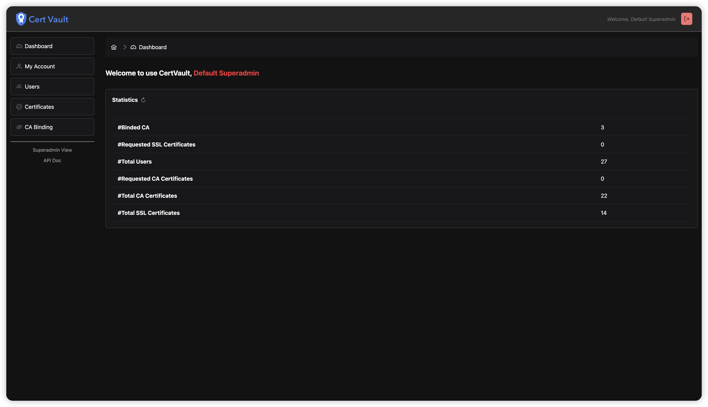

<div align="center">
    
    <br/>
    <p style="font-size: large"><strong>A Self-Signed SSL Certificate Issuance and Management Platform </strong></p>
    <a href="https://github.com/gregPerlinLi/CertVault/releases"></a>
    <a href="https://github.com/gregPerlinLi/CertVault/actions/workflows/backend-ci.yaml"></a>
    <a href="https://github.com/gregPerlinLi/CertVault/blob/main/LICENSE"></a>
    <a href="https://github.com/gregPerlinLi/CertVault/issues"></a>
    <a href="https://github.com/gregPerlinLi/CertVault/issues?q=is%3Aissue%20state%3Aclosed"></a>
    <a href="https://github.com/gregPerlinLi/CertVault/contributors"> </a>
    <a href="https://github.com/gregPerlinLi/CertVault/stargazers"></a>
    <a href="https://github.com/gregPerlinLi/CertVault/releases"></a>

</div>

---

> **[中文](README_CN.md) | English**

## 🌍 What is CertVault

CertVault is a platform designed to automate the issuance, management, and lifecycle control of self-signed SSL/TLS certificates. It provides a modular architecture with features including CA certificate creation, SSL certificate issuance/renewal, detailed metadata management, RBAC-based permissions, and multi-environment deployment capabilities. The platform is built with a decoupled frontend/backend architecture using **Vue.js 3** and **Spring Boot 3**, supporting **MySQL/PostgreSQL** databases and offering deployment solutions via **Docker Compose** and **Helm Charts** for Kubernetes environments. Built-in Prometheus metrics and OIDC authentication ensure robust observability and security compliance.

<table>
  <tr>
    <td width="50%" align="center"><b>Dashboard</b></td>
    <td width="50%" align="center"><b>CA Certificate Management</b></td>
  </tr>
  <tr>
    <td></td>
    <td></td>
  </tr>
  <tr>
    <td width="50%" align="center"><b>SSL Certificate Management</b></td>
    <td width="50%" align="center"><b>User Management</b></td>
  </tr>
  <tr>
    <td></td>
    <td></td>
  </tr>
</table>

## 🎯 Design Intentions

The platform was developed to address critical challenges in self-signed certificate management:
1. **Operational Complexity**: Manual processes for certificate lifecycle management lead to human errors and inefficiencies in tracking expiration dates and permissions.
2. **Security Gaps**: Lack of centralized encryption storage and standardized access control increases risk of credential leakage.
3. **Scalability Limitations**: Traditional tools fail to adapt to modern infrastructure requirements like multi-cloud deployments and database heterogeneity.
4. **Audit Deficiencies**: Absence of audit trails complicates compliance with security regulations and troubleshooting.

Key design objectives:
- 🛠 **Automation First**: Implement API-driven workflows for certificate generation and renewal
- 🔒 **Security by Default**: Sensitive data is stored using encrypted storage, integrated with OIDC authentication system, and achieves fine-grained RBAC permission control.
- 🔄 **Infrastructure Flexibility**: Supports Docker/Kubernetes multienvironment deployment, compatible with mainstream database systems
- 📊 **Observability**: Prometheus metrics for certificate expiration warnings and system performance monitoring
- 🤝 **Community-Driven**: Open API specifications and modular architecture encourage third-party integration and ecosystem growth

This platform is ideal for organizations needing centralized certificate management in DevOps workflows, microservices architectures, and IoT device ecosystems where secure communication is critical.

## 🚀 Features

### Core Features
- 🔐 **Certificate Management**  
  Supports self-signed CA creation, SSL certificate issuance, certificate details viewing, comment editing, export, and renewal
- 🛠 **User Permissions**  
  RBAC-based access control with role binding, user role management, and audit logs
- 🌐 **Multi-Environment Deployment**  
  MySQL/PostgreSQL database support, Docker Compose and Helm Chart deployment solutions
- 🔍 **Monitoring Integration**  
  Prometheus metrics for monitoring integration with Grafana
- 🔑 **Security Enhancements**  
  OIDC authentication, encrypted sensitive data storage, and granular API permissions

## 🛠 Technology Stack

### 🌐 Frontend
- **Vue.js 3** + **Vite**
- **PrimeVue** UI components
- **TailwindCSS** responsive styling
- **TypeScript** typed development

### 🖥️ Backend
- **Java 17** + **Spring Boot 3**
- **MyBatis-Plus** ORM framework
- **Druid** database connection pool
- **Redis** caching service
- **Helm Chart** Kubernetes deployment

### 📦 Others
- **Kubernetes** orchestration
- **Prometheus** monitoring metrics
- **Traditional/OIDC** authentication
- **MySQL/PostgreSQL** database

## 🖋️ Quick Start

### Prerequisites

- Docker 
- Docker Compose

### Installation

```bash
git clone https://github.com/gregPerlinLi/CertVault.git
cd docker-compose
docker compose -f docker-compose-with-postgres-redis.yml up -d
```

## 📚 Guidance

- [How to deployment](docs/Deployment.md)
- How to use

## 🧰 Related Projects

- [CertVault CLI](https://github.com/gregPerlinLi/CertVaultCLI): A CLI tool for CertVault Platform
- [CertVault Charts](https://github.com/gregPerlinLi/certvault-charts): Helm Charts for CertVault Platform

## 📊 Statistics


## 🤝 Contributing

Contributions are what make the open source community such an amazing place to learn, inspire, and create. Any contributions you make are **greatly appreciated**.

If you have a suggestion that would make this better, please fork the repo and create a pull request. You can also simply open an issue with the tag "enhancement". Don't forget to give the project a star!

## 📄 Code of Conduct

Please read [CODE_OF_CONDUCT.md](CODE_OF_CONDUCT.md) for details on our code of conduct, and the process for submitting pull requests to us.

## 🛡️ Security

See [SECURITY.md](SECURITY.md) for more information.

## 📝 LICENSE

This project is licensed under the Apache 2.0 License - see the [LICENSE](LICENSE) file for details.
