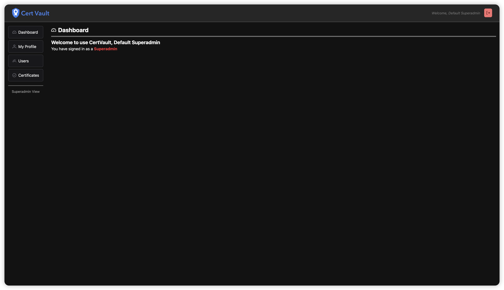
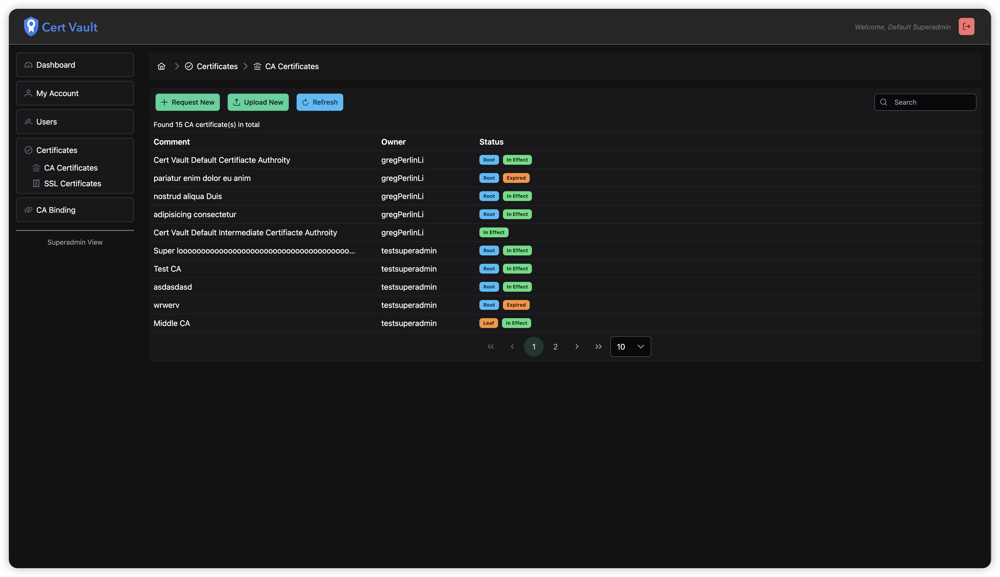
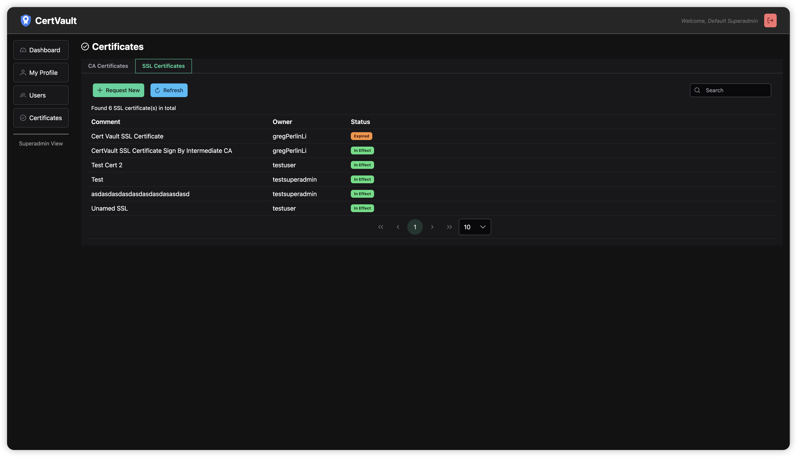

<div align="center">
    
    <br/>
    <p style="font-size: large"><strong>自签名 SSL 证书颁发与管理平台</strong></p>
    <a href="https://github.com/gregPerlinLi/CertVault/releases"></a>
    <a href="https://github.com/gregPerlinLi/CertVault/actions/workflows/backend-ci.yaml"></a>
    <a href="github.com/gregPerlinLi/CertVault/blob/main/LICENSE"></a>
    <a href="https://github.com/gregPerlinLi/CertVault/issues"></a>
    <a href="https://github.com/gregPerlinLi/CertVault/contributors"> </a>
    <a href="https://github.com/gregPerlinLi/CertVault/languages"></a>
    <a href="https://github.com/gregPerlinLi/CertVault/stargazers"></a>
    <a href="https://github.com/gregPerlinLi/CertVault/releases"></a>
</div>

---

> **中文 | [English](README.md)**

## 🌍 CertVault 是什么


CertVault 是一个专注于自签名 SSL 证书签发与管理的平台，提供了一套可扩展、可配置的解决方案。它通过模块化设计实现了证书全生命周期管理，支持自签名 CA 证书创建、SSL 证书签发、证书详情查看、评论编辑、导出及自动续期功能。平台采用前后端分离架构（Vue.js 3 + Spring Boot 3），支持 MySQL/PostgreSQL 双数据库适配，并通过 Helm Chart 和 Docker Compose 实现多环境部署。集成 Prometheus 监控与 OIDC 认证体系，确保系统可观测性和高安全性。


<table>
  <tr>
    <td width="50%" align="center"><b>仪表盘</b></td>
    <td width="50%" align="center"><b>CA 证书管理</b></td>
  </tr>
  <tr>
    <td></td>
    <td></td>
  </tr>
  <tr>
    <td width="50%" align="center"><b>SSL 证书管理</b></td>
    <td width="50%" align="center"><b>用户管理</b></td>
  </tr>
  <tr>
    <td></td>
    <td></td>
  </tr>
</table>

## 🎯 设计初衷

随着企业级应用对 HTTPS 安全性的要求提升，自签名证书在开发测试、私有化部署等场景中广泛应用。但传统手动管理方式存在以下痛点：
1. **管理低效**：证书有效期跟踪、权限分配、版本迭代等操作依赖人工记录，易出现证书过期或权限失控
2. **安全性不足**：缺乏统一密钥管理体系，敏感数据存储和传输存在泄露风险
3. **扩展性差**：无法适配不同环境（开发/生产）的数据库和部署需求
4. **审计缺失**：缺乏操作日志和权限变更追踪机制

CertVault 的设计目标是：
- 🛠 **自动化管理**：通过 API 化证书生命周期管理，支持自动续期
- 🔒 **安全增强**：采用加密存储敏感数据，集成 OIDC 认证体系，实现细粒度 RBAC 权限控制
- 🔄 **环境适配**：支持 Docker/Kubernetes 多环境部署，兼容主流数据库系统
- 📊 **可观测性**：通过 Prometheus/Grafana 实现证书状态和系统性能的可视化监控
- 🤝 **开源协作**：提供完整文档和社区贡献机制，促进生态共建

该平台特别适用于需要自主掌控证书体系的私有化部署场景，如企业内部服务、微服务网关、IoT 设备证书管理等场景。

## 🚀 功能

### 核心功能
- 🔐 **证书管理**  
  支持自签名 CA 创建、SSL 证书签发、证书详情查看、评论编辑、导出和续期
- 🛠 **用户权限**  
  基于 RBAC 的访问控制、角色绑定、用户角色管理及审计日志
- 🌐 **多环境部署**  
  支持 MySQL/PostgreSQL 数据库，提供 Docker Compose 和 Helm Chart 部署方案
- 🔍 **监控集成**  
  提供 Prometheus 监控指标，支持 Grafana 集成
- 🔑 **安全增强**  
  OIDC 认证、敏感数据加密存储、细粒度 API 权限

## 技术栈

### 🌐 前端
- **Vue.js 3** + **Vite**
- **PrimeVue** UI 组件
- **TailwindCSS** 响应式样式
- **TypeScript** 类型化开发

### 🖥️ 后端
- **Java 17** + **Spring Boot 3**
- **MyBatis-Plus** ORM 框架
- **Druid** 数据库连接池
- **Redis** 缓存服务
- **Helm Chart** Kubernetes 部署

### 📦 其他
- **Kubernetes** 容器编排
- **Prometheus** 监控指标
- **传统/OIDC** 认证
- **MySQL/PostgreSQL** 数据库

## 🖋️ 快速开始

### 前提条件
- Docker 
- Docker Compose

### 安装
```bash
git clone https://github.com/gregPerlinLi/CertVault.git
cd docker-compose
docker compose -f docker-compose-with-postgres-redis.yml up -d
```
## 📚 使用指南
- 如何安装
- 如何使用
- 环境配置

## 🤝 贡献
贡献使开源社区成为学习、启发和创造的绝佳场所。您所做的任何贡献都**非常宝贵**。

如果您有改进建议，请 fork 仓库并创建 pull request。您也可以直接提交带有 "enhancement" 标签的 issue。别忘了给项目点赞～

## 📄 行为准则
请阅读 [CODE_OF_CONDUCT.md](CODE_OF_CONDUCT.md) 了解我们的行为准则，以及提交 pull request 的流程。

## 🛡️ 安全
更多信息请参见 [SECURITY.md](SECURITY.md)。

## 📝 许可证
本项目基于 Apache 许可证发布 - 具体信息请参见 [LICENSE](LICENSE) 文件。
